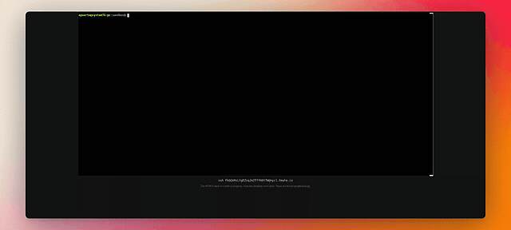
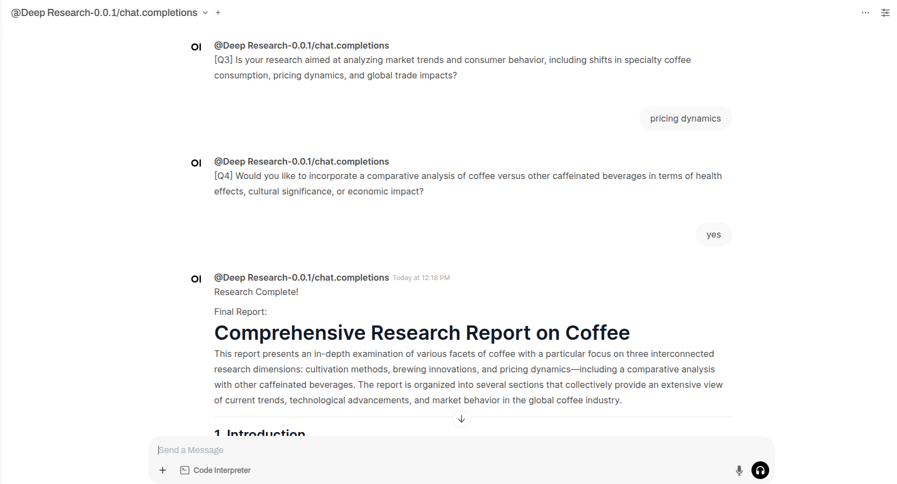

# 🐍 Deep Research Assistant PY

An AI-powered research tool in Python that helps you explore topics in depth using AI and web search.

## Save 200 dollars a month and use this tool

⭐ A python port with a little more cli pizzazz of [https://github.com/epuerta9/deep-research-py](https://github.com/epuerta9/deep-research-py)

⭐ Add support for gemini and google serp api (`https://serper.dev/`).

⭐ Add a evaluation step after each epoch rather than wholly based on depth param

⭐ Tweak some prompts with more logs for debugging

Contribute all you want to this. It was fun tweaking it.

[video demo](https://app.arcade.software/share/e6N8mBQlAMbdc0dmOuS1)



## Project Structure

```plaintext
deep_research_py/
├── run.py              # Main CLI interface
├── deep_research.py    # Core research logic
├── feedback.py         # Follow-up question generation
├── prompt.py           # System prompts for AI
└── ai/
    ├── providers.py    # AI service configuration
    └── text_splitter.py # Text processing utilities
```

## Features

- **Interactive Research**: Asks follow-up questions to better understand your needs
- **Depth Control**: Customize research breadth and depth
- **Web Integration**: Uses Firecrawl for reliable web content extraction
- **Smart Synthesis**: Combines multiple sources into coherent findings
- **Beautiful CLI**: Rich text interface with progress tracking
- **Markdown Reports**: Generates well-formatted research reports

## Installation

```bash
uv tool install deep-research-py && cp .env.example .env
```

### Optional: Install Playwright (only needed for `playwright_*` scraper options)
```bash
playwright install
```

**Note**: If you're using `serper_only` (recommended), you don't need to install Playwright.

### Docker with OpenWebUI



If you would rather chat with deep-reasearch with an OpenAI client like OpenWebUI,
You can build this project with docker.

```bash
docker compose up
```
The OpenAI endpoint should be set at `http://localhost:8000/v1`

This can be configured on the OpenWebUI settings -> Connections -> Add connection
(api key can be anything)


## Configuration
Open `.env` and replace placeholder values with your actual API keys

### Set up environment variables in .env file:
```bash
# Required: GEMINI API key (unless using DeepSeek or another provider)
GEMINI_API_KEY=your-openai-key-here

# Scraper Configuration - Choose one of the following options:
DEFAULT_SCRAPER="serper_only"  # Recommended for simplicity

# Option 1: Serper.dev only (Recommended)
# Uses Serper.dev for both search and scraping - fastest and most reliable
SERPER_API_KEY=your-serper-key-here

# Option 2: Firecrawl (Alternative)
# Uses Firecrawl for both search and scraping
FIRECRAWL_API_KEY=your-firecrawl-key-here
# FIRECRAWL_BASE_URL="http://localhost:3002"  # If self-hosting

# Option 3: Mixed approaches (Advanced)
# DEFAULT_SCRAPER="playwright_serper"  # Serper search + Playwright scraping
# DEFAULT_SCRAPER="playwright_ddgs"    # DuckDuckGo search + Playwright scraping
```

### Scraper Options Explained:

- **`serper_only`** (Recommended): Uses Serper.dev for both search and scraping. Fast, reliable, and requires only a Serper.dev API key.
- **`firecrawl`**: Uses Firecrawl for both search and scraping. Good alternative but requires Firecrawl API key.
- **`playwright_serper`**: Uses Serper.dev for search and Playwright for scraping. More resource-intensive but handles complex websites.
- **`playwright_ddgs`**: Uses DuckDuckGo for search and Playwright for scraping. Free search but requires browser automation.

Note: If you prefer, you can use DeepSeek instead of OpenAI. You can configure it in the `.env` file by setting the relevant API keys and model. Additionally, ensure that you set `DEFAULT_SERVICE` to `"deepseek"` if using DeepSeek or `"openai"` if using OpenAI.

## Usage

Run the research assistant:

```bash
deep-research
```

You'll be prompted to:
1. Enter your research topic
2. Set research breadth (2-10, default 4)
3. Set research depth (1-5, default 2)
4. Answer follow-up questions
5. Wait while it researches and generates a report

You can change the concurrency level by setting the `--concurrency` flag (useful if you have a high API rate limit):

```bash
deep-research --concurrency 10
```

You can get a list of available commands:

```bash
deep-research --help
```

## Development Setup

Clone the repository and set up your environment:

```bash
# Clone the repository
git clone https://github.com/epuerta9/deep-research-py.git
cd deep-research-py

# Create and activate virtual environment
uv venv
source .venv/bin/activate

# Install in development mode
uv pip install -e .

# Copy environment configuration
cp .env.example .env

# Set your API keys by editing the .env file

# Optional: Install playwright dependencies (only if using playwright_* scrapers)
playwright install

# Run the tool
deep-research
```

## Requirements

- Python 3.9 or higher
- OpenAI API key (GPT-4 access recommended) OR DeepSeek API key
- **For `serper_only` (Recommended)**: Serper.dev API key
- **For `firecrawl`**: Firecrawl API key  
- **For Playwright options**: Playwright installation (see below)

### Core Dependencies:
- openai
- typer
- rich
- prompt-toolkit
- aiohttp
- aiofiles
- tiktoken

### Optional Dependencies (based on scraper choice):
- firecrawl-py (for `firecrawl` option)
- playwright (for `playwright_*` options)
- duckduckgo-search (for `playwright_ddgs` option)

## Output

The tool generates:
- A markdown report saved as `output.md`
- List of sources used
- Summary of key findings
- Detailed analysis of the topic

## License

MIT

## Contributing

Contributions are welcome! Please follow these steps:

1. Fork the repository
2. Create your feature branch (`git checkout -b feature/amazing-feature`)
3. Install development dependencies:
```bash
pip install pre-commit
pre-commit install
```
4. Make your changes
6. Commit your changes (`git commit -m 'Add amazing feature'`)
7. Push to the branch (`git push origin feature/amazing-feature`)
8. Open a Pull Request
