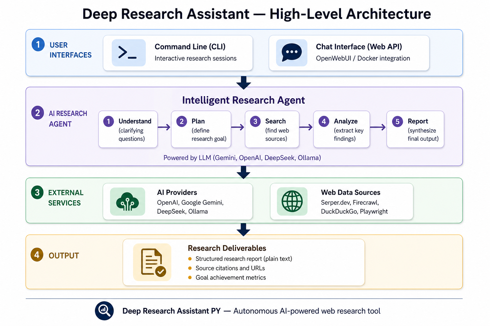
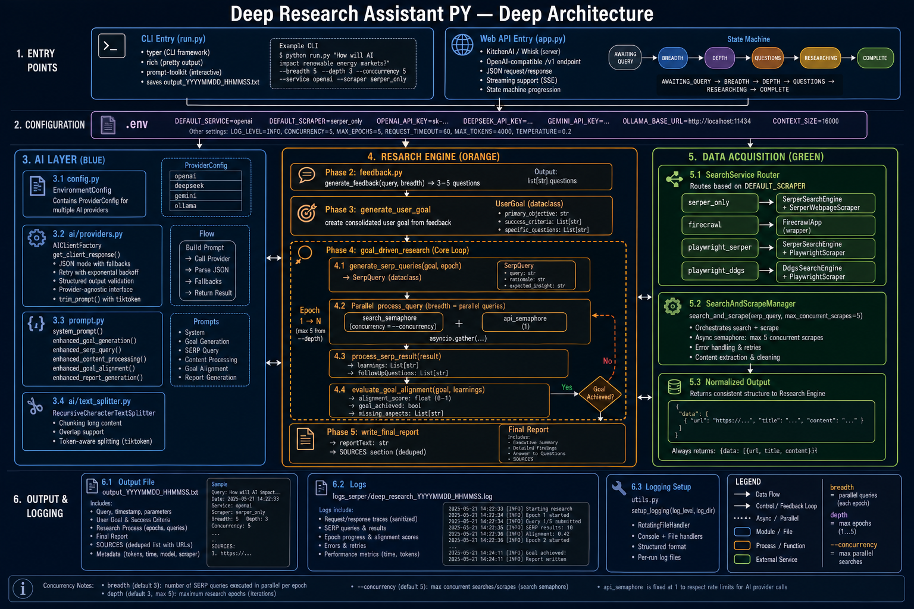
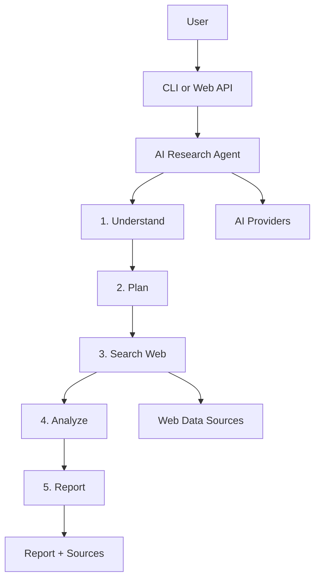
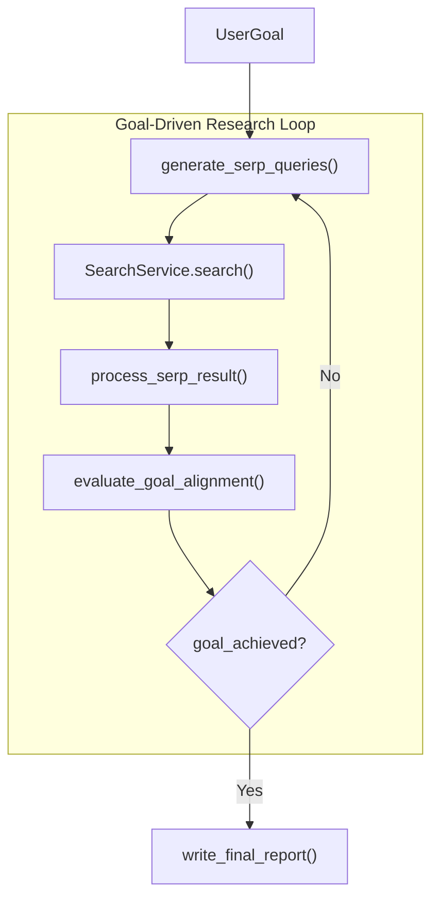

# Deep Research Assistant PY — Architecture

This document provides two views of the system:

1. **High-Level Architecture** — for stakeholders and quick understanding
2. **Deep Architecture** — for developers implementing or extending the system

---

## High-Level Architecture

A simplified view of how the system works end-to-end.



### What it does (in plain language)

| Step | Name | Description |
|------|------|-------------|
| 1 | **Understand** | Asks clarifying questions about your research topic |
| 2 | **Plan** | Defines a measurable research goal with success criteria |
| 3 | **Search** | Finds relevant web pages using configurable search/scrape backends |
| 4 | **Analyze** | Extracts key learnings from each source using an LLM |
| 5 | **Report** | Synthesizes all findings into a structured research report with citations |

### Key interfaces

- **CLI** — Run `deep-research` in the terminal for interactive sessions
- **Web API** — Run via Docker; exposes an OpenAI-compatible endpoint for chat UIs like OpenWebUI

### External dependencies

- **AI Providers** — Gemini, OpenAI, DeepSeek, or Ollama (configurable via `.env`)
- **Web Data** — Serper.dev, Firecrawl, DuckDuckGo, or Playwright (configurable via `DEFAULT_SCRAPER`)

---

## Deep Architecture

A detailed technical view showing modules, data flow, and internal loops.



### Entry points

| Module | Command | Purpose |
|--------|---------|---------|
| `deep_research_py/run.py` | `deep-research` | CLI with Rich UI, progress tracking, file output |
| `deep_research_py/app.py` | `whisk serve` (Docker) | Stateful chat API via KitchenAI/Whisk |

### Research pipeline (5 phases)

```
User Input → Follow-up Q&A → Goal Generation → Research Loop → Final Report
```

#### Phase 2 — Clarification (`feedback.py`)

- LLM generates 3–5 strategic follow-up questions
- User answers interactively (CLI) or via chat turns (Web API)

#### Phase 3 — Goal definition (`deep_research.py`)

Creates a structured `UserGoal`:

```python
UserGoal(
    primary_objective: str,
    success_criteria: List[str],
    specific_questions: List[str],
)
```

#### Phase 4 — Goal-driven research loop

Runs in **epochs** (1 to `depth`, capped at 5):

```
┌─────────────────────────────────────────────────────────┐
│  For each epoch:                                        │
│    1. generate_serp_queries()     → breadth queries     │
│    2. SearchService.search()      → URLs + content     │
│    3. process_serp_result()       → extract learnings   │
│    4. evaluate_goal_alignment()   → score & gaps        │
│    5. Stop if goal_achieved OR max epochs reached       │
└─────────────────────────────────────────────────────────┘
```

**Concurrency controls:**

- `--concurrency` — parallel web searches per epoch
- `api_semaphore(1)` — serializes LLM calls to reduce rate limits
- `search_semaphore(concurrency)` — limits parallel scrape operations

#### Phase 5 — Report (`write_final_report()`)

- Synthesizes all learnings into plain-text report
- Appends `SOURCES` section with visited URLs
- Saves to `output_YYYYMMDD_HHMMSS.txt`

### AI layer

| File | Responsibility |
|------|----------------|
| `config.py` | Provider configs (OpenAI, Gemini, DeepSeek, Ollama) |
| `ai/providers.py` | Client factory, JSON parsing, token trimming |
| `ai/text_splitter.py` | Context window management |
| `prompt.py` | All LLM prompts (goal, queries, alignment, report) |

All providers use the **OpenAI-compatible** `AsyncOpenAI` client.

### Data acquisition layer

| Scraper mode | Search | Scrape | API key |
|--------------|--------|--------|---------|
| `serper_only` ⭐ | Serper.dev | Serper webpage API | `SERPER_API_KEY` |
| `firecrawl` | Firecrawl | Firecrawl | `FIRECRAWL_API_KEY` |
| `playwright_serper` | Serper.dev | Playwright browser | Serper + Playwright |
| `playwright_ddgs` | DuckDuckGo | Playwright browser | Playwright only |

All backends normalize to:

```json
{ "data": [{ "url": "...", "title": "...", "content": "..." }] }
```

### Web API state machine

```
AWAITING_QUERY → AWAITING_BREADTH → AWAITING_DEPTH
  → ASKING_QUESTIONS → RESEARCHING → COMPLETE
```

Conversation state is stored in-memory (`conversation_states` dict).

### Output artifacts

| File | Contents |
|------|----------|
| `output_*.txt` | Report, metadata, domain breakdown, sources |
| `logs_serper/deep_research_*.log` | Full debug logs (prompts, URLs, tokens) |

---

## Mermaid Diagrams (for editing / export)

### High-level flow



### Deep research loop


